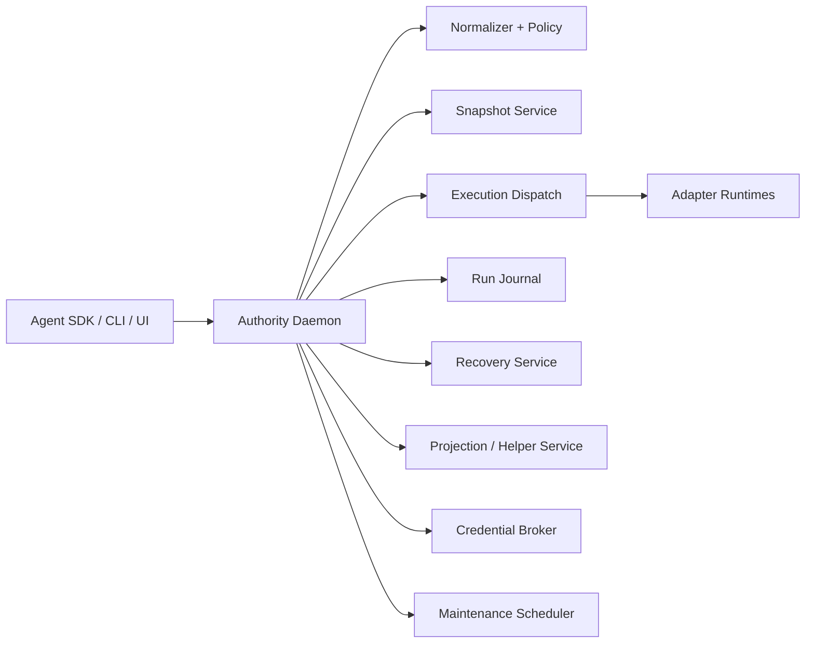

# 01. Runtime Architecture

## Working Thesis

The launch system should run as a local authority daemon with a small number of tightly owned runtime services behind one IPC boundary.

That means:

- SDKs and CLIs talk to one local authority endpoint
- core decision-making stays inside the authority process
- side-effecting execution still happens through explicit adapter runtimes
- maintenance work can be offloaded to background workers without changing the external authority contract

The launch architecture should feel like one product, not a cluster.

## Why This Matters

If the runtime is too fragmented at launch:

- coordination gets hard too early
- crash recovery becomes confusing
- local-first installation becomes brittle
- the trust boundary becomes ambiguous

If the runtime is too monolithic forever:

- maintenance and isolation become harder later
- long-running work can block interactive paths
- platform-specific execution logic becomes messy

So the right launch architecture is:

**one authority daemon, modular internals, and a clear path to split selected workers later**

## Core Responsibilities Of The Local Runtime

The local runtime must support all of these without requiring a hosted control plane:

- accept governed tool attempts
- normalize actions
- evaluate policy
- create snapshots
- dispatch execution
- append journal events
- plan and execute recovery
- serve timeline/helper queries
- run maintenance jobs
- broker credentials
- detect platform capabilities

That is why a real local control-plane process exists at all.

## Launch Process Model

## Primary process: authority daemon

This should be the single local process the rest of the system talks to.

Responsibilities:

- SDK/session registration
- action admission pipeline
- policy and snapshot orchestration
- execution dispatch
- run journal writes
- projection updates or projection scheduling
- recovery planning
- helper query routing
- capability detection cache
- credential broker coordination
- maintenance scheduling

This process is the control plane in local-first form.

## Secondary surfaces

These are not separate control planes. They are clients of the authority daemon.

### SDK clients

- TypeScript SDK
- Python SDK
- future direct framework adapters

### CLI client

- local debugging and inspection
- manual approval and restore commands
- diagnostics and maintenance commands

### Local UI client

- timeline
- approval inbox
- recovery preview
- run summaries

### Optional worker processes

These can be separate only when the cost is justified:

- browser/computer execution harness
- heavy snapshot compaction worker
- projection rebuild worker

At launch, these should still be supervised by the authority daemon.

## Recommended Launch Topology

## Internal Service Boundaries

The authority daemon should be one process, but internally it should have clear service modules.

## 1. Session Gateway

Responsibilities:

- authenticate local client sessions if needed
- register runs
- receive tool attempts
- assign run-local sequence reservations if needed
- enforce API version compatibility

Inputs:

- SDK calls
- CLI commands
- UI queries

Outputs:

- runtime requests to the action pipeline

## 2. Action Pipeline Coordinator

Responsibilities:

- orchestrate:
  - normalization
  - policy
  - snapshot
  - execution dispatch
- ensure each phase emits journal events in the right order

This is the transactional coordinator for interactive action handling.

## 3. Execution Dispatch Service

Responsibilities:

- select the correct adapter
- materialize execution context
- request credentials from the broker
- run adapters in the correct mode
- collect `ExecutionResult` and artifacts

This service owns the jump from “approved plan” to “real side effect.”

## 4. Journal Service

Responsibilities:

- append immutable `RunEvent` records
- expose projection rebuild hooks
- manage transaction boundaries for event writes

This service should be treated as the most sensitive persistence boundary in the runtime.

## 5. Projection / Helper Service

Responsibilities:

- maintain or serve timeline projections
- answer structured helper queries
- synthesize grounded explanations from indexed facts

This should read from the journal and projections, not from transient in-memory state alone.

## 6. Recovery Service

Responsibilities:

- compute recovery plans
- run impact analysis
- orchestrate recovery execution through the same governed action path

## 7. Capability Service

Responsibilities:

- detect filesystem, shell, and OS features
- cache capability state
- expose capability flags to policy, snapshot, and execution services

## 8. Maintenance Scheduler

Responsibilities:

- schedule GC
- snapshot compaction
- projection rebuilds
- SQLite WAL checkpointing
- retention cleanup

This is the runtime piece most likely to become a separate worker orchestration layer later.

## 9. Credential Broker

Responsibilities:

- resolve brokered credentials for owned integrations
- expose scoped handles to adapters
- avoid leaking raw secrets into agent-visible paths

## IPC Model

The authority daemon should expose one local IPC API.

### Launch recommendation

Use:

- Unix domain sockets on macOS/Linux
- named pipes on Windows later

Reasons:

- local-only trust boundary
- good fit for long-lived daemon
- avoids accidental remote exposure
- aligns with local-first design

## API style

The local authority API should be request/response for most operations, with optional streaming for long-running tasks.

### Core request families

- `register_run`
- `submit_action_attempt`
- `resolve_approval`
- `query_timeline`
- `query_helper`
- `plan_recovery`
- `execute_recovery`
- `run_maintenance`
- `get_capabilities`
- `diagnostics`

### Streaming-worthy operations

- long-running browser execution
- projection rebuild progress
- maintenance progress
- recovery execution progress

## In-Process Vs Out-Of-Process Rules

The runtime should apply a simple rule:

### Keep in-process at launch

- normalizer
- policy engine
- journal service
- projection reads
- recovery planning
- capability detection cache
- maintenance scheduler logic

### Allow out-of-process when justified

- browser/computer harnesses
- isolated shell runners later
- heavy maintenance workers
- future hosted sync agent

The launch goal is low operational complexity, not purity.

## Request Lifecycle

For a governed action attempt, the runtime should follow this lifecycle:

1. session gateway receives request
2. coordinator assigns request context
3. normalizer produces `Action`
4. journal appends `action.normalized`
5. policy evaluates and emits `PolicyOutcome`
6. journal appends `policy.evaluated`
7. if snapshot required, snapshot service creates `SnapshotRecord`
8. journal appends `snapshot.created`
9. execution dispatch runs adapter
10. journal appends execution lifecycle events
11. projection service updates or schedules timeline projections
12. response returns to client

This is the main interactive critical path.

## Startup Lifecycle

On daemon startup, the runtime should do the following in order:

1. load config
2. acquire single-instance lock for the local authority root
3. open journal and supporting stores
4. verify schema/store versions
5. run capability detection
6. initialize credential broker
7. recover in-flight runs and maintenance tasks
8. open IPC endpoint
9. start maintenance scheduler

The authority should not accept action traffic before storage and crash-recovery checks are complete.

## Shutdown Lifecycle

On graceful shutdown:

1. stop accepting new interactive actions
2. finish or cancel in-flight noncritical tasks
3. checkpoint journal/projection state as needed
4. mark interrupted long-running tasks for recovery
5. close IPC endpoint
6. release local lock

## Crash Recovery

The runtime must assume that crashes happen in the middle of real work.

On restart, it should reconcile:

- runs with `execution.started` but no terminal execution event
- recoveries with `recovery.started` but no terminal recovery event
- maintenance jobs that may have been in progress
- pending approvals that were durable but unresolved

Recommended behavior:

- append reconciliation events instead of mutating prior rows
- mark uncertain execution outcomes explicitly
- rescan relevant stores when exact state is uncertain

## Concurrency Model

The launch runtime should optimize for:

- one authority daemon writer
- many local readers
- bounded concurrent adapter executions

### Recommended rules

- journal writes are serialized through the authority process
- projections can lag but must be rebuildable
- maintenance jobs yield to interactive work
- heavy snapshot compaction should not block action admission

This aligns with the SQLite-backed journal and local-first model.

## Scheduling Model

The runtime should distinguish:

### Interactive-critical work

- action normalization
- policy evaluation
- snapshot creation on critical path
- execution dispatch
- approval resolution
- helper reads

### Deferred work

- blob compaction
- projection rebuilds
- GC
- retention pruning
- expensive artifact post-processing

### Hybrid work

- snapshot compaction after many journals
- browser session cleanup
- recovery plan precomputation

The scheduler should prioritize low-latency interactive paths over maintenance.

## Isolation Model

The launch runtime should use logical isolation first, not full OS sandboxing everywhere.

### Launch isolation boundaries

- governed execution surfaces
- writable root restrictions
- explicit credential injection boundaries
- adapter-specific timeouts and resource constraints

### Future stronger isolation

- isolated shell workers
- network proxy enforcement
- OS sandbox integration

The runtime architecture should make these future upgrades possible without changing the outer authority API.

## Health And Diagnostics

The runtime should expose internal health state for:

- journal availability
- snapshot store health
- blob/artifact store health
- credential broker status
- capability detection summary
- maintenance backlog
- projection lag

This should be queryable from the CLI and local UI.

## Local State Ownership

The authority daemon should be the owner of:

- the active journal writer
- projection refresh triggers
- maintenance scheduling
- brokered credential handoff

This prevents split-brain local behavior.

## Failure Domains

The runtime should model failures by domain.

### Authority-core failures

Examples:

- journal unavailable
- schema mismatch
- IPC endpoint bind failure

Impact:

- system should fail closed for governed execution

### Adapter failures

Examples:

- shell runner crash
- browser harness disconnect
- MCP upstream failure

Impact:

- action-level failure or partial completion
- journal remains authoritative

### Maintenance failures

Examples:

- compaction crash
- projection rebuild failure

Impact:

- degrade noncritical behavior
- should not break action admission by default

## Security Posture

The runtime architecture should assume:

- local machine trust is partial, not absolute
- the daemon must not expose a network-accessible control surface by default
- secrets must not be passed through model-visible outputs
- governed execution must fail closed when key trust requirements are missing

## Launch Recommendation

For launch, the runtime should be:

- one authority daemon
- one local IPC API
- one journal writer
- modular internals
- optional supervised helper workers only where necessary

This is the smallest runtime that still preserves the trust and recovery model of the product.

## Future Evolution Path

The architecture should be able to evolve into:

- isolated adapter workers
- sync agent for hosted control plane
- separate maintenance worker pool
- stronger sandbox and egress enforcement
- multi-client local UI and approval surfaces

without changing the conceptual center:

**all governed actions pass through one local authority boundary**
