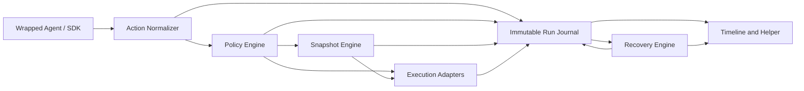

# System Architecture

Status note:

- this document describes the full target architecture
- for audited launch/runtime truth, use `/Users/geoffreyfernald/Documents/agentgit/engineering-docs/CURRENT-IMPLEMENTATION-STATE.md`
- browser/computer governance, generic governed HTTP, and durable queued workers are not part of the current launch/runtime claim

## Purpose

This document ties the eight subsystem docs together into one end-to-end architecture for the local-first execution control layer.

It describes:

- the runtime boundary
- the core data flow
- the trust model
- the storage model
- the user-facing surfaces

## System Thesis

The product is an execution authority layer for agents.

It sits between:

- an agent runtime
- tool and environment access
- real-world side effects

Its job is to let agents operate with high autonomy while:

- constraining blast radius
- preserving reversibility where possible
- making runs understandable afterward

## Local-First Rule

The launch architecture is local-first in a strict sense:

- local storage is canonical
- local execution is authoritative
- local history remains valid offline
- hosted systems are optional coordination and retention layers

This system should be designed so cloud support feels like a seamless additive layer, not a swap in who owns truth.

## Core Product Loop

The full loop is:

1. a wrapped agent attempts an action
2. the action is normalized
3. policy decides what to do
4. a snapshot is created when needed
5. an execution adapter performs the action
6. the immutable journal records the history
7. the recovery engine determines what can be restored or compensated
8. the timeline and helper turn that history into understanding

That is the whole system in one sentence:

**govern actions before execution, preserve recovery boundaries during execution, and explain the outcome after execution**

Implementation planning companion:

- [v1-repo-package-module-plan.md](/Users/geoffreyfernald/Documents/agentgit/engineering-docs/v1-repo-package-module-plan.md)

## The Eight Subsystems

### 1. Agent Wrapper / SDK

Source doc:

- [01-agent-wrapper-sdk/README.md](/Users/geoffreyfernald/Documents/agentgit/engineering-docs/01-agent-wrapper-sdk/README.md)

Role:

- defines the governed boundary
- wraps tools and runtimes
- forwards tool attempts to the authority layer
- enforces mandatory tool wrapping for governed actions

Key launch requirements:

- mandatory tool wrapping
- runtime credential brokering for owned integrations

### 2. Action Normalizer

Source doc:

- [02-action-normalizer/README.md](/Users/geoffreyfernald/Documents/agentgit/engineering-docs/02-action-normalizer/README.md)

Role:

- creates the canonical `Action`
- turns tool/runtime-specific requests into one stable cross-subsystem shape
- records provenance, execution path, scope, and risk hints

Key design choice:

- one action equals the smallest governable execution boundary

### 3. Policy Engine

Source doc:

- [03-policy-engine/README.md](/Users/geoffreyfernald/Documents/agentgit/engineering-docs/03-policy-engine/README.md)

Role:

- evaluates the action
- returns `allow`, `deny`, `ask`, `simulate`, or `allow_with_snapshot`
- enforces trust rules, budgets, safe modes, and approval conditions

Key design choice:

- deterministic layered policy beats opaque scoring

### 4. Snapshot Engine

Source doc:

- [04-snapshot-engine/README.md](/Users/geoffreyfernald/Documents/agentgit/engineering-docs/04-snapshot-engine/README.md)

Role:

- creates rollback boundaries before risky recoverable actions
- chooses the cheapest snapshot class that still satisfies the recovery promise

Key design choice:

- journal-first, anchor-second, dedupe only where it pays

### 5. Execution Adapters

Source doc:

- [05-execution-adapters/README.md](/Users/geoffreyfernald/Documents/agentgit/engineering-docs/05-execution-adapters/README.md)

Role:

- perform the approved side effect
- enforce preconditions
- inject brokered credentials when needed
- emit `ExecutionResult` and typed artifacts

Key design choice:

- policy decides, adapters enforce and execute, artifacts explain

### 6. Immutable Run Journal

Source doc:

- [06-immutable-run-journal/README.md](/Users/geoffreyfernald/Documents/agentgit/engineering-docs/06-immutable-run-journal/README.md)

Role:

- stores the append-only memory of the system
- ties actions, policy, snapshots, execution, approvals, and recovery into one durable causal history

Key design choice:

- projections are derived, history is canonical

### 7. Recovery Engine

Source doc:

- [07-recovery-engine/README.md](/Users/geoffreyfernald/Documents/agentgit/engineering-docs/07-recovery-engine/README.md)

Role:

- produces restore, compensation, or remediation plans
- executes recovery where supported
- surfaces confidence and impact before change

Key design choice:

- be explicit about `reversible`, `compensatable`, `review_only`, and `irreversible`

### 8. Timeline and Helper

Source doc:

- [08-timeline-and-helper/README.md](/Users/geoffreyfernald/Documents/agentgit/engineering-docs/08-timeline-and-helper/README.md)

Role:

- projects raw history into readable steps
- answers grounded questions about what happened, what changed, and what can be safely done next

Key design choice:

- grounded explanation first, model synthesis second

## Cross-Subsystem Records

The entire system revolves around a small canonical record set:

- `Action`
- `PolicyOutcome`
- `SnapshotRecord`
- `ExecutionResult`
- `RunEvent`
- `RecoveryPlan`
- `TimelineStep`

These are defined in:

- [schema-pack/README.md](/Users/geoffreyfernald/Documents/agentgit/engineering-docs/schema-pack/README.md)
- [schema-pack/action.schema.json](/Users/geoffreyfernald/Documents/agentgit/engineering-docs/schema-pack/action.schema.json)
- [schema-pack/policy-outcome.schema.json](/Users/geoffreyfernald/Documents/agentgit/engineering-docs/schema-pack/policy-outcome.schema.json)
- [schema-pack/snapshot-record.schema.json](/Users/geoffreyfernald/Documents/agentgit/engineering-docs/schema-pack/snapshot-record.schema.json)
- [schema-pack/execution-result.schema.json](/Users/geoffreyfernald/Documents/agentgit/engineering-docs/schema-pack/execution-result.schema.json)
- [schema-pack/run-event.schema.json](/Users/geoffreyfernald/Documents/agentgit/engineering-docs/schema-pack/run-event.schema.json)
- [schema-pack/recovery-plan.schema.json](/Users/geoffreyfernald/Documents/agentgit/engineering-docs/schema-pack/recovery-plan.schema.json)
- [schema-pack/timeline-step.schema.json](/Users/geoffreyfernald/Documents/agentgit/engineering-docs/schema-pack/timeline-step.schema.json)

## Trust Model

The system has four important trust boundaries.

### 1. Governed execution path

Actions routed through:

- wrapped SDK tools
- governed shell/filesystem/browser runtimes
- governed MCP proxy paths
- owned API adapters

can be actively controlled before side effects happen.

### 2. Observed path

Actions discovered after the fact through:

- file watchers
- process/activity traces
- imported logs
- external evidence

can be explained, but not controlled in the same way.

### 3. Unknown path

If the system cannot determine the true execution boundary or provenance, it must label the action honestly as `unknown`.

### 4. Credential boundary

Owned integrations should use:

- brokered or delegated credentials

instead of raw durable credentials in the agent prompt or environment whenever possible.

## End-to-End Runtime Flow

## Phase 1. Intent Capture

The agent wrapper intercepts a tool attempt and creates a governed runtime envelope.

Output:

- run/session context
- tool registration context
- raw attempted call

## Phase 2. Canonicalization

The action normalizer produces an `Action`.

Output:

- stable action ID
- provenance
- execution path
- scope
- risk hints

## Phase 3. Decision

The policy engine evaluates the action and emits `PolicyOutcome`.

Possible outputs:

- `allow`
- `deny`
- `ask`
- `simulate`
- `allow_with_snapshot`

## Phase 4. Protection

If required, the snapshot engine creates `SnapshotRecord`.

Possible snapshot classes:

- `metadata_only`
- `journal_only`
- `journal_plus_anchor`
- `exact_anchor`

## Phase 5. Execution

The correct execution adapter performs the action and emits `ExecutionResult` plus artifacts.

Examples:

- file diffs
- stdout/stderr
- screenshots
- request/response summaries

## Phase 6. Durable Memory

The run journal records each phase as immutable `RunEvent` records.

This is the canonical causal history.

## Phase 7. Recovery Understanding

The recovery engine uses the action, snapshot, execution, and journal history to decide:

- whether the boundary is reversible
- whether compensation is possible
- what the impact of recovery would be

## Phase 8. Human Understanding

The timeline/helper layer projects all of that into:

- readable steps
- recovery affordances
- grounded answers

## Dataflow Diagram

## Storage Architecture

The local-first design has three main storage surfaces.

### 1. Journal store

Purpose:

- immutable event history
- projections
- artifact metadata

Likely implementation:

- SQLite on local disk

### 2. Snapshot store

Purpose:

- manifests
- journals
- anchors
- content-addressed blob store

Likely implementation:

- local filesystem plus embedded metadata store

### 3. Artifact/blob store

Purpose:

- screenshots
- large diffs
- stdout/stderr blobs
- imported evidence payloads

Likely implementation:

- local content-addressed storage with retention policies

## Hosted Extension Rule

When hosted support is added later:

- local `Action`, `PolicyOutcome`, `SnapshotRecord`, `ExecutionResult`, `RunEvent`, `RecoveryPlan`, and `TimelineStep` generation should remain unchanged
- hosted services should consume selected local records through sync/export
- local governed execution should not be rewritten around remote storage

That is the key to making cloud support feel seamless instead of architectural drift.

## Launch Wedge

The architecture is intentionally optimized for:

- local coding agents
- MCP-connected agents
- browser/computer-use agents

Why:

- the trust boundary is understandable
- snapshotting and recovery are tractable
- the pain is immediate
- the user can verify value quickly

## Launch Guarantees

The system should only promise what the architecture can really support.

### Strongest guarantees

- governed local file and shell paths
- exact or high-confidence restore for protected local paths
- durable event history for governed actions
- explicit approvals and budgets

### Medium guarantees

- compensation for owned external integrations
- recovery planning for browser and remote workflows

### Weakest guarantees

- imported or observed-only external actions
- low-trust remote side effects

These should still be recorded and explained, but not oversold as fully reversible.

## Cross-Cutting Principles

These principles appear in every subsystem.

### 1. Honest provenance

Never pretend observed equals governed.

### 2. Recoverability over interruption

Bias toward `allow_with_snapshot` when the action is risky but recoverable.

### 3. Grounded explanation

Narration must come from structured history, not freeform speculation.

### 4. Minimal sufficient retention

Keep the smallest amount of data required to preserve rollback and understanding.

### 5. Derived views are rebuildable

The event history is canonical; projections are conveniences.

## Suggested Repo Layout

A likely implementation layout, once code starts, could be:

- `packages/authority-sdk-*`
- `packages/normalizer`
- `packages/policy-engine`
- `packages/snapshot-engine`
- `packages/execution-adapters`
- `packages/run-journal`
- `packages/recovery-engine`
- `packages/timeline-helper`
- `packages/schemas`

This is not required yet, but the schemas and subsystem docs are now strong enough to support it.

## Next Implementation Steps

The architecture is now ready for a concrete v1 build plan.

The next best technical steps are:

1. validate the schema pack against example records
2. create interface stubs or types from the schemas
3. decide language/runtime boundaries for the first implementation
4. build the action -> policy -> snapshot -> execution -> journal happy path
5. add recovery and timeline projections on top
