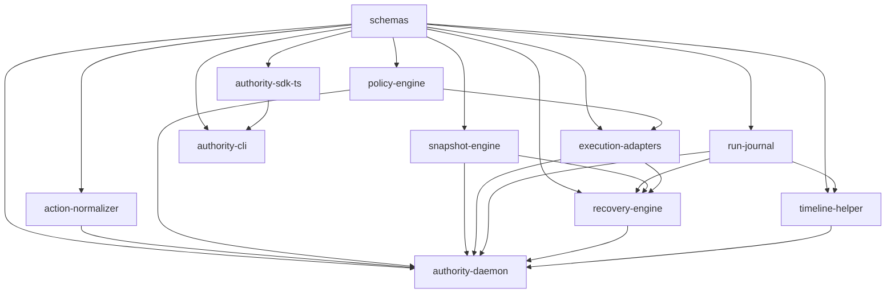

# V1 Repo, Package, And Module Plan

Status note:

- this document is the historical implementation plan
- for audited current runtime truth, use `/Users/geoffreyfernald/Documents/agentgit/engineering-docs/CURRENT-IMPLEMENTATION-STATE.md`
- the currently built MCP slice is local operator-owned only; it now includes durable MCP server registry state, durable local encrypted MCP secret storage, and explicit public host policy management, while hosted and arbitrary remote MCP remain future work
- the public npm release path for `@agentgit/schemas`, `@agentgit/authority-sdk`, and `@agentgit/authority-cli` is now active; `.changeset/` is no longer just a future placeholder

## Purpose

This document turns the architecture set into a concrete implementation plan for the first code-bearing version of the repo.

It defines:

- the launch repo shape
- which packages exist in v1
- which packages are publishable vs internal
- the major modules inside each package
- the dependency direction between packages
- the recommended milestone order

This is the bridge between the design docs and the first real scaffold.

## Planning Rules

- local-first is non-negotiable
- one authority daemon owns the control plane
- the schema pack is the contract spine
- publish only what needs a stable external developer surface
- keep the hot path boring, explicit, and easy to debug
- optimize for launching a real OSS tool, not for theoretical elegance

## Repo Shape

Launch the repo as a pnpm + Turborepo monorepo with a small number of package types:

- publishable npm packages
- internal daemon/runtime packages
- one Python SDK package co-located in the repo
- docs and fixture assets
- local operator apps can live alongside the core packages when they stay thin and daemon-backed

Recommended top-level layout:

```text
/Users/geoffreyfernald/Documents/agentgit
├── apps/
│   └── inspector-ui/                 # local operator timeline/helper/recovery UI
├── packages/
│   ├── authority-daemon/
│   ├── authority-sdk-ts/
│   ├── authority-sdk-py/
│   ├── schemas/
│   ├── action-normalizer/
│   ├── policy-engine/
│   ├── snapshot-engine/
│   ├── execution-adapters/
│   ├── mcp-registry/
│   ├── run-journal/
│   ├── recovery-engine/
│   ├── timeline-helper/
│   ├── authority-cli/
│   └── test-fixtures/
├── engineering-docs/
├── scripts/
├── .changeset/                       # later, when publishing starts
├── pnpm-workspace.yaml
├── turbo.json
├── package.json
└── README.md
```

## Package Strategy

### Publishable npm packages

These are the packages we should expect to expose to external developers:

- `@agentgit/authority-sdk`
- `@agentgit/schemas`
- `@agentgit/authority-cli`

These may be published later, but they should be designed with that possibility from the start:

- `@agentgit/policy-engine`
- `@agentgit/action-normalizer`

### Internal runtime packages

These should start internal and move slowly:

- `authority-daemon`
- `snapshot-engine`
- `execution-adapters`
- `mcp-registry`
- `run-journal`
- `recovery-engine`
- `timeline-helper`

### Co-located but non-npm package

- `authority-sdk-py`

This should live in the monorepo for coherence, but it should not distort the TypeScript package structure. Treat it as a sibling package with its own packaging metadata and tests.

## Package Responsibilities

## `packages/schemas`

Role:

- owns the canonical JSON schemas
- exports generated TypeScript types
- exports schema validation helpers for runtime use
- owns example fixtures and validation harness

Why it exists:

- every subsystem depends on the same record contracts
- this package prevents type drift between daemon, SDK, CLI, and tests

Key modules:

- `src/schema-ids.ts`
- `src/load-schema.ts`
- `src/validators.ts`
- `src/types/`
- `examples/`

Publish:

- yes

## `packages/authority-sdk-ts`

Role:

- first-party TypeScript SDK
- wraps governed tool registrations
- opens local daemon sessions
- sends raw action attempts into the daemon

Key launch rule:

- this package stays thin
- it should not reimplement policy, snapshot logic, journal logic, or recovery planning

Key modules:

- `src/client/authority-client.ts`
- `src/client/ipc-transport.ts`
- `src/session/register-run.ts`
- `src/tools/wrap-tool.ts`
- `src/tools/wrap-filesystem.ts`
- `src/tools/wrap-shell.ts`
- `src/tools/wrap-mcp.ts`
- `src/errors.ts`

Publish:

- yes

## `packages/authority-sdk-py`

Role:

- same conceptual surface as the TypeScript SDK
- thin Python wrapper for local daemon integration

Key modules:

- `agentgit_authority/client.py`
- `agentgit_authority/session.py`
- `agentgit_authority/tools.py`
- `agentgit_authority/errors.py`

Publish:

- Python package later
- not part of the initial npm release path

## `packages/action-normalizer`

Role:

- converts raw tool attempts into canonical `Action` records
- owns mapper registry and normalization heuristics

Key modules:

- `src/registry.ts`
- `src/normalize.ts`
- `src/mappers/filesystem-v1.ts`
- `src/mappers/shell-v1.ts`
- `src/mappers/mcp-v1.ts`
- `src/mappers/function-v1.ts`
- `src/mappers/browser-v1.ts`
- `src/redaction.ts`
- `src/confidence.ts`

Publish:

- not initially
- possible later if we want external custom mapper ecosystems

## `packages/policy-engine`

Role:

- deterministic rule evaluation
- safe mode compilation
- budget checks
- approval requirement calculation

Key modules:

- `src/evaluate.ts`
- `src/rule-loader.ts`
- `src/predicate-evaluator.ts`
- `src/safe-modes.ts`
- `src/budgets.ts`
- `src/approvals.ts`
- `src/reason-codes.ts`

Publish:

- maybe later
- internal for v1

## `packages/snapshot-engine`

Role:

- chooses snapshot class
- creates manifests, journals, anchors
- runs compaction and retention logic

Key modules:

- `src/select-snapshot-class.ts`
- `src/manifest-store.ts`
- `src/journal-capture.ts`
- `src/anchor-store.ts`
- `src/path-classifier.ts`
- `src/storage-budget.ts`
- `src/compaction.ts`
- `src/gc.ts`
- `src/integrity.ts`

Publish:

- no

## `packages/execution-adapters`

Role:

- actual side-effecting adapters
- precondition enforcement
- credential injection at execution boundaries

Current audited runtime note:

- launch-real adapters are `filesystem`, `shell`, and owned `function` integrations
- `src/browser-adapter.ts` and `src/http-adapter.ts` were part of the historical plan, not the shipped launch/runtime surface
- unsupported browser/computer requests now fail closed instead of simulating execution

Key modules:

- `src/registry.ts`
- `src/base-adapter.ts`
- `src/filesystem-adapter.ts`
- `src/apply-patch-adapter.ts`
- `src/shell-adapter.ts`
- `src/mcp-proxy-adapter.ts`
- `src/browser-adapter.ts`
- `src/http-adapter.ts`
- `src/artifact-capture.ts`

Publish:

- no

## `packages/run-journal`

Role:

- append-only journal over SQLite
- projection materialization hooks
- event and artifact indexes

Key modules:

- `src/db/open.ts`
- `src/db/migrations.ts`
- `src/events/append.ts`
- `src/events/query.ts`
- `src/projections/run-summary.ts`
- `src/projections/timeline.ts`
- `src/projections/approvals.ts`
- `src/projections/helper-facts.ts`
- `src/artifacts/store.ts`

Publish:

- no

## `packages/recovery-engine`

Role:

- builds restore, compensate, and remediate plans
- evaluates recovery confidence and impact preview
- submits recovery actions back into the authority pipeline

Key modules:

- `src/plan-recovery.ts`
- `src/strategies/restore.ts`
- `src/strategies/compensate.ts`
- `src/strategies/remediate.ts`
- `src/impact-preview.ts`
- `src/execute-recovery.ts`

Publish:

- no

## `packages/timeline-helper`

Role:

- builds timeline steps from canonical facts
- supports grounded helper queries and summaries

Key modules:

- `src/project-timeline.ts`
- `src/project-step-details.ts`
- `src/helper/fact-cache.ts`
- `src/helper/query-parser.ts`
- `src/helper/grounded-answer.ts`
- `src/helper/summarize-run.ts`

Publish:

- no

## `packages/authority-daemon`

Role:

- runtime composition root
- IPC server
- action pipeline coordinator
- one local control-plane process

This is the package that wires the rest together.

Key modules:

- `src/main.ts`
- `src/config/load-config.ts`
- `src/ipc/server.ts`
- `src/ipc/envelope.ts`
- `src/api/hello.ts`
- `src/api/register-run.ts`
- `src/api/submit-action-attempt.ts`
- `src/api/resolve-approval.ts`
- `src/api/query-timeline.ts`
- `src/api/query-helper.ts`
- `src/api/plan-recovery.ts`
- `src/api/execute-recovery.ts`
- `src/api/run-maintenance.ts`
- `src/api/get-capabilities.ts`
- `src/pipeline/action-coordinator.ts`
- `src/runtime/startup.ts`
- `src/runtime/shutdown.ts`
- `src/runtime/reconcile.ts`

Publish:

- no

## `packages/authority-cli`

Role:

- developer/operator-facing CLI
- local inspection and debug surface
- approval and recovery commands

Key modules:

- `src/main.ts`
- `src/commands/daemon.ts`
- `src/commands/runs.ts`
- `src/commands/timeline.ts`
- `src/commands/approve.ts`
- `src/commands/recover.ts`
- `src/commands/diagnostics.ts`

Publish:

- yes

## `packages/test-fixtures`

Role:

- reusable fixtures for integration tests
- small shared helpers that active repo tests actually import
- seeded temporary workspace support for adversarial filesystem-style tests

Key modules:

- `src/index.ts`

Publish:

- no

## Dependency Direction

The dependency rule should be simple:

- contracts flow outward from `schemas`
- orchestration lives in `authority-daemon`
- subsystem packages do not import the daemon
- SDKs and CLI depend on the daemon protocol, not the daemon internals

Recommended dependency graph:



Practical interpretation:

- `authority-daemon` depends on the subsystem packages
- subsystem packages depend on `schemas`
- `authority-cli` depends on the same IPC contract the SDK uses
- no package should create circular dependencies with `run-journal`

## First-Class Runtime Boundaries

The repo should make these runtime boundaries obvious:

- SDK/client boundary
- daemon IPC boundary
- side-effecting adapter boundary
- SQLite and artifact storage boundary
- optional future worker boundary

That means:

- no subsystem reaches into another package's private storage directly
- all persisted records move through typed interfaces
- test doubles should attach at the same seams as production code

## Launch Sequence

Do not try to build every package at once.

Build in this order:

## Milestone 0. Repo bootstrap

Deliverables:

- pnpm workspace
- turbo config
- base TypeScript config
- lint, format, test harness
- package skeletons

Definition of done:

- repo installs
- all packages build
- no product logic yet

## Milestone 1. Contracts and daemon handshake

Packages in focus:

- `schemas`
- `authority-daemon`
- `authority-sdk-ts`
- `authority-cli`

Deliverables:

- schema package exported
- `hello`
- `register_run`
- local IPC transport
- basic CLI ping and diagnostics

Definition of done:

- TS SDK can connect to daemon and register a run
- CLI can inspect daemon status

## Milestone 2. Journal-first runtime spine

Packages in focus:

- `run-journal`
- `authority-daemon`
- `schemas`

Deliverables:

- SQLite open/migrate
- append `run.created`
- append `run.started`
- query run summary
- basic artifact store plumbing

Definition of done:

- daemon can create runs and durably journal lifecycle events

## Milestone 3. Action normalization and policy

Packages in focus:

- `action-normalizer`
- `policy-engine`
- `authority-daemon`

Deliverables:

- raw action submission
- filesystem mapper
- shell mapper
- deterministic policy evaluation
- safe mode bootstrap
- `submit_action_attempt` returning a policy outcome

Definition of done:

- governed filesystem and shell attempts normalize and receive decisions

## Milestone 4. First real governed execution

Packages in focus:

- `execution-adapters`
- `authority-daemon`
- `run-journal`

Deliverables:

- filesystem adapter
- apply-patch adapter
- execution preconditions
- `execution.started` and `execution.completed/failed`

Definition of done:

- one governed file mutation can flow end-to-end from SDK to journaled result

## Milestone 5. Snapshot-backed recovery boundary

Packages in focus:

- `snapshot-engine`
- `execution-adapters`
- `authority-daemon`

Deliverables:

- manifest capture
- journal-only snapshots
- snapshot selection logic
- `allow_with_snapshot`
- restore from a simple file mutation

Definition of done:

- one risky local mutation can be snapshot-protected and restored

## Milestone 6. Timeline and approvals

Packages in focus:

- `timeline-helper`
- `run-journal`
- `authority-cli`
- `authority-daemon`

Deliverables:

- timeline projection
- approval inbox projection
- `resolve_approval`
- CLI timeline view

Definition of done:

- user can understand a run and approve a blocked action

## Milestone 7. Recovery planning

Packages in focus:

- `recovery-engine`
- `timeline-helper`
- `authority-daemon`

Deliverables:

- `plan_recovery`
- impact preview
- restore strategy for local filesystem actions
- journaled recovery execution

Definition of done:

- failed or risky local filesystem actions have real recovery plans

## Milestone 8. MCP proxy and brokered credentials

Packages in focus:

- `execution-adapters`
- `authority-sdk-ts`
- `authority-daemon`

Deliverables:

- MCP proxy adapter
- credential handle plumbing
- brokered credential enforcement
- untrusted MCP mutation approval path

Definition of done:

- governed MCP tool calls can be normalized, gated, approved, executed, and explained

## Milestone 9. Local beta hardening

Packages in focus:

- all runtime packages

Deliverables:

- crash reconciliation
- compaction jobs
- policy reload
- diagnostics
- fixture-driven integration tests
- packaging and install path

Definition of done:

- local-first OSS beta install is credible for external users

## What Not To Build Before Beta

- hosted sync
- cloud-owned history
- multi-tenant auth
- Windows-first support
- generalized plugin marketplace
- enterprise policy DSL
- advanced network egress control
- OS sandboxing as a launch dependency

## First Scaffolding Pass

If we start coding after this document, the very first scaffold should create:

- `packages/schemas`
- `packages/authority-daemon`
- `packages/authority-sdk-ts`
- `packages/authority-cli`
- `packages/run-journal`

Why this slice:

- it creates a working local authority loop quickly
- it proves the local-first process model
- it gives us a real command path before we invest in harder subsystems

## First End-To-End Demo

The first demo worth optimizing for is:

1. start local daemon
2. register a run from the TS SDK
3. submit one filesystem write action
4. normalize it
5. evaluate policy
6. execute it through the filesystem adapter
7. append events to the journal
8. view the resulting timeline in the CLI

If the repo can do that cleanly, the architecture has crossed from theory into product reality.
